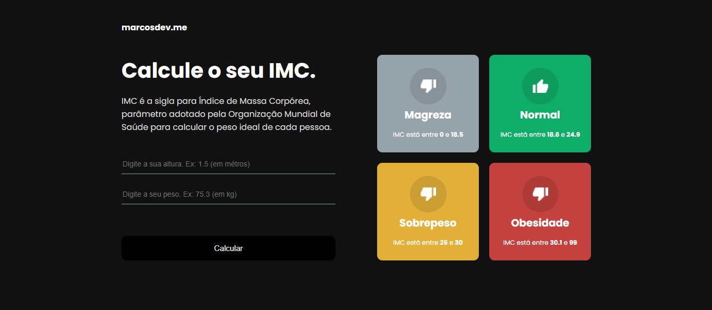

<p align="center">
    <a href="https://imc-iamdevmarcos.vercel.app/">
      
    </a>
</p>

# React IMC

> IMC calculator made with React, Context, TypeScript and Styled-Components.

Be sure to send your feedback.

## Technology stack

- **Front-end:** [React.Js](https://reactjs.org/)
- **Typing:** [Typescript](https://www.typescriptlang.org/)
- **Build:** [Vite](https://vitejs.dev/)

## Running locally

1. Clone this repo:

```sh
$ git clone https://github.com/iamdevmarcos/react-imc.git
```

2. Then go to the project's folder:

```sh
cd react-imc
```

3. Install all dependencies:

```sh
npm install
```

4. Run locally:

```sh
npm run dev
```

## Autor

| [<br><sub>@iamdevmarcos</sub>](https://github.com/iamdevmarcos) |
| :---------------------------------------------------------------------------------------------------------------------------------------: |
